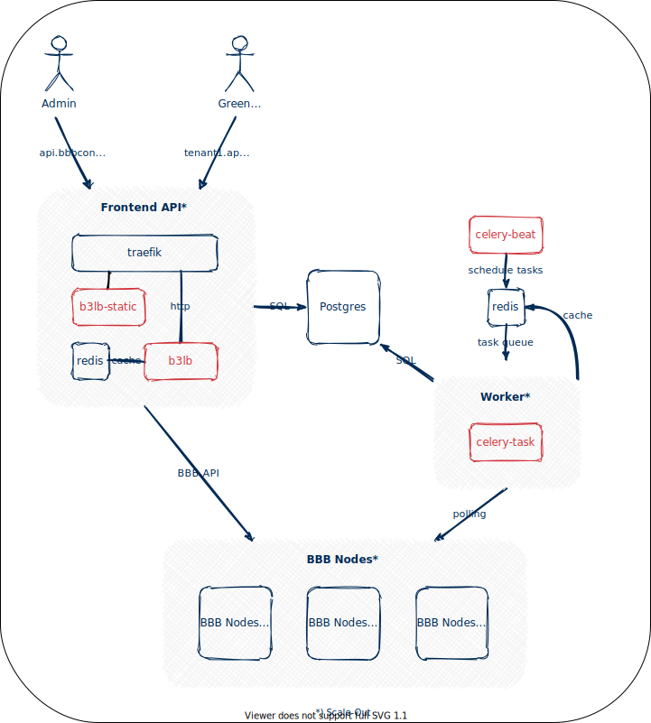

About
=====

B3LB is based on the Django_ Python Web framework and is designed to work in large scale-out deployments with 100+ BigBlueButton nodes and high attendee join rates.

.. _Django: https://www.djangoproject.com/

Architecture
::::::::::::

To scale for a huge number of attendees it is possible to:

- scale-out the B3LB API frontends
- scale-out the B3LB polling workers
- scale-out your BBB nodes

Features
::::::::

- multiple b3lb frontend instances
- backend BBB node polling using `Celery <http://celeryproject.org/>`_
- extensive caching based on `Redis <https://redis.io/>`_
- robust against high BBB node response times (i.e. due to ongoing DDoS attacks)

BBB Clustering
--------------

- supports a high number of BBB nodes
- different load balancing factors per cluster
- load calculation by attendees, meetings and CPU load metrics
- maintenance mode allows to disable BBB nodes gracefully

BBB Frontend API
----------------

- deployed on ASGI with `uvicorn <https://www.uvicorn.org/>`_
- HTTP call-outs are implementated async using `aiohttp <https://docs.aiohttp.org/>`_
- support API key rollover using a second secret
- prebuild responses for expensive API calls (``getMeetings``)
- limiting attendees or meetings per tenant
- does not implement but blocks recording API calls

Multitenancy
------------

- per-tenant API hostnames
- start presentation injection
- branding logo injection
- multiple API secrets per tenant

Monitoring
----------

- simple health-check URL
- simple json statistics URL
- prometheus metrics URL

Load Calculation
::::::::::::::::

To select a BBB node for new meetings B3LB calculates a load value for the BBB nodes. The load is based on three metrics:

- number of attendees
- number of meetings
- cpu utilization (base 10.000)

Each of the metrics is important for deciding where to spawn new meetings. The cpu utilization depends on the current load caused by running meetings and also respects external effects of the BBB nodes. The number of meetings is important since it is an indicator that more attendees may join and cause even more load in the future.

.. math::
  \begin{array}{clc}
  \mathbf{\text{Metric}} & \mathbf{\text{Description}} & \mathbf{\text{Origin}} \\
  cpu_{15s} & \text{cpu utilization in the last 15s} & \text{node} \\
  cpu_{1m} & \text{cpu utilization in the last minute} & \text{node} \\
  n_{atn} & \text{number of active attendees} & \text{node} \\
  n_{mtg} & \text{number of active meetings} & \text{node} \\
  \end{array}

  \\
  \\

  \begin{array}{cclc}
  \mathbf{\text{Tunable}} & \mathbf{\text{Default}} & \mathbf{\text{Description}} & \mathbf{\text{Origin}} \\
  cpu_{max} & 5.000 & \text{target max cpu utilization} & \text{cluster} \\
  cpu_{order} & 6 & \text{order of Taylor polynomial} & \text{cluster} \\
  f_{atn} & 1 & \text{load factor for a single attendee} & \text{cluster} \\
  f_{mtg} & 30 & \text{load factor for a single meeting} & \text{cluster} \\
  \end{array}

  \\
  \\

  load_{node} = f_{atn} * n_{atn} + f_{mtg} * n_{mtg} + \frac{cpu_{max}}{cpu_{order}} * \sum_{n=1}^{cpu_{order}} {\left[\frac{ \max {\left(cpu_{1m}, cpu_{15s}\right)} }{10.000}\right]}^{n}

The cpu utilization is reinforced using a Taylor polynomial to get a slow increate as long the cpu utilization is below :math:`cpu_{max}`. Above of the thresold the load increases exponential.

.. plot::

   import matplotlib.pyplot as plt
   import numpy as np
   x = np.arange(0,10000)
   y = 0

   for n in range(1,6):
     y += pow(x/10000, n)
   y *= 5000/6

   y += 150 + 10*30

   plt.plot(x,y)
   plt.xlabel("$\mathregular{\max {(cpu_{1m}, cpu_{15s})}}$")
   plt.ylabel("$\mathregular{load_{node}}$")
   plt.title("$\mathregular{n_{atn}=150;n_{mtg}=10}$")
   plt.show()

Container Images
::::::::::::::::

B3LB provides in three different docker image provided on `Docker Hub <https://hub.docker.com/search?q=b3lb&type=image>`_ and `GitHub Packages <https://github.com/orgs/DE-IBH/packages?ecosystem=docker>`_. The images can be build from source using the provided `Dockerfiles <https://github.com/DE-IBH/b3lb/tree/main/docker>`_.

.. hint::
    It is intentional that there are no `b3lb:latest` nor `b3lb-static:latest` image tags available. You should always pick a explicit version for your deployment.

b3lb
----

This image contains the Django files of b3lb to run
the ASGI application, Celery tasks and manamgenet CLI commands.

.. tab:: Docker Hub

    ::

        docker pull ibhde/b3lb:1.2.0

.. tab:: GitHub Packages

    ::

        docker pull docker.pkg.github.com/de-ibh/b3lb/b3lb:1.2.0

b3lb-static
-----------

Uses the `Caddy <https://caddyserver.com/>`_ webserver to provide static
assets for the Django admin UI and can be used to publish per-tenant assets.

.. tab:: Docker Hub

    ::

        docker pull ibhde/b3lb-static:1.2.0

.. tab:: GitHub Packages

    ::

        docker pull docker.pkg.github.com/de-ibh/b3lb/b3lb-static:1.2.0

b3lb-dev
--------
This is the development build of b3lb using Djangos single threaded build-in webserver. You should never use this in production.

.. tab:: Docker Hub

    ::

        docker pull ibhde/b3lb-dev:latest

.. tab:: GitHub Packages

    ::

        docker pull docker.pkg.github.com/de-ibh/b3lb/b3lb-dev:latest
