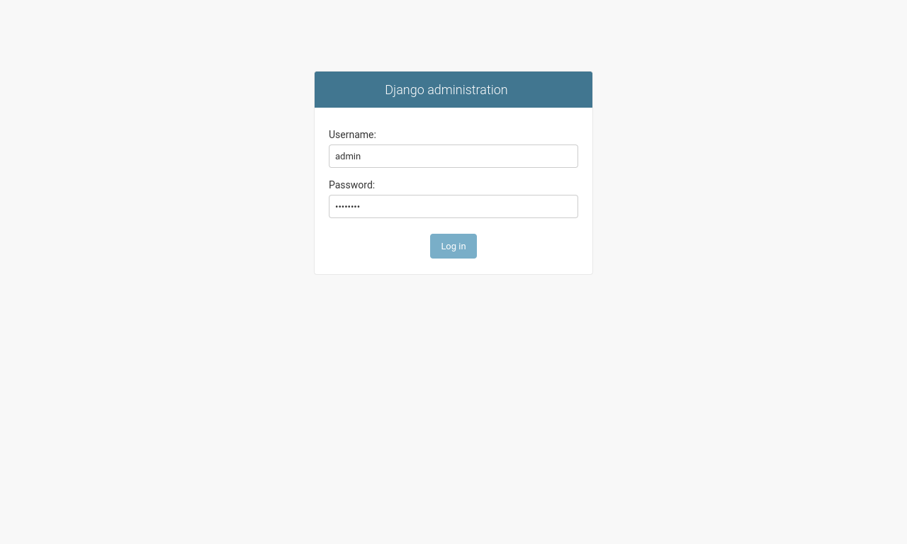
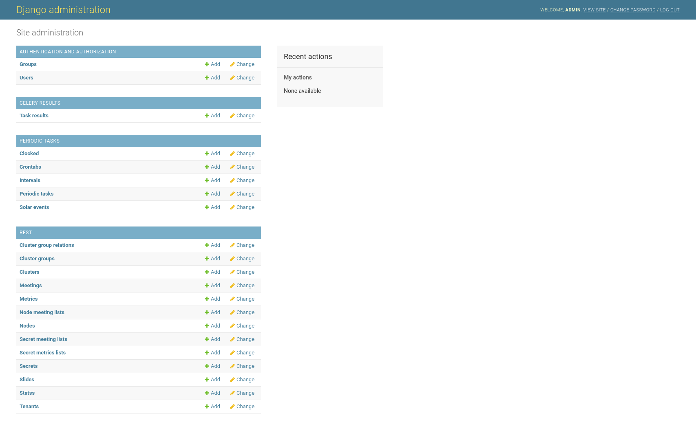
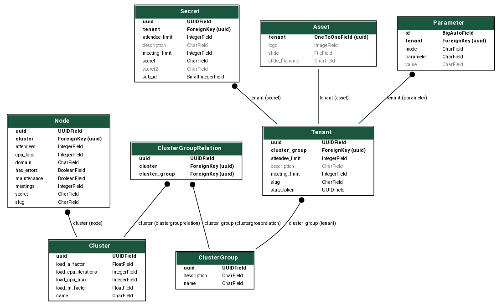

Django Admin
============

You need to do the following initial operations to get your B3LB instance operational.

Initial fixture
---------------

B3LB ships with a initial fixture to configure the celery scheduled tasks:

.. code-block:: console

    $ docker-compose exec django ./manage.py loaddata periodictasks
    Installed 6 object(s) from 1 fixture(s)

Create a superuser
------------------

A initial Django superuser login needs to be created on the CLI to be able to login to the Django admin pages:

.. code-block:: console

    $ docker-compose exec django ./manage.py createsuperuser
    Username (leave blank to use 'root'): admin
    Email address: admin@bbbconf.de
    Password:
    Password (again):
    Superuser created successfully.

Login at ``https://{{ api_base_domain }}/admin/`` using the admin credentials:

After logging in you are able to view and edit the Django models:

Models
------

With the admin login you can configure the required backend instances. The following schema shows the relation between models used in *B3LB* and to be used by the admin:

The models are used for:

**Cluster**

    A group of BBB *Nodes* with the same load balancing parameters. If running different types of hardware or VM nodes you should consider to put group them into diffent *Clusters* so that the load balancing parameters can be tuned per *Cluster*.

**ClusterGroup**

    A group of *Clusters* which can be used by *Tenants*. This is just a indirection layer if you have many clusters. In small environemnts there might only by a single *ClusterGroup*. *Cluster* can be assigned to multple *ClusterGroups*.

**ClusterGroupRelation**

    Maps a *Cluster* to a *ClusterGroup*.

**Node**

    A single host running a BigBlueButton instance. It is related to a single *Cluster*. The *Node*'s FQDN is build from the `slug` and the `domain` property.

**Secret**

    A BigBlueButton API secret related to a tenant. A tenant might have multple secrets. Attendee and meeting limits are enforced at the secret level and at *Tenant* level - whatever exceeds first.

**Asset**

    A *Tenant* can have an *Asset*. With an *Asset* it is possible to assign a startup slide and a branding logo to a *Tenant*.

**Parameter**

    With *Parameter*s are assigned to a *Tenant* and can be used to set, override or block BBB API `create parameters <https://docs.bigbluebutton.org/dev/api.html#create>_`.

**Tenant**

    Is allowed to use the B3LB's BigBlueButton API. A *Tenant* requires at least one *Secret* with sub_id of ``0`` before the API can be used. Attendee and meeting limits are enforced over all *Secrets* assigned to the *Tenant*.
