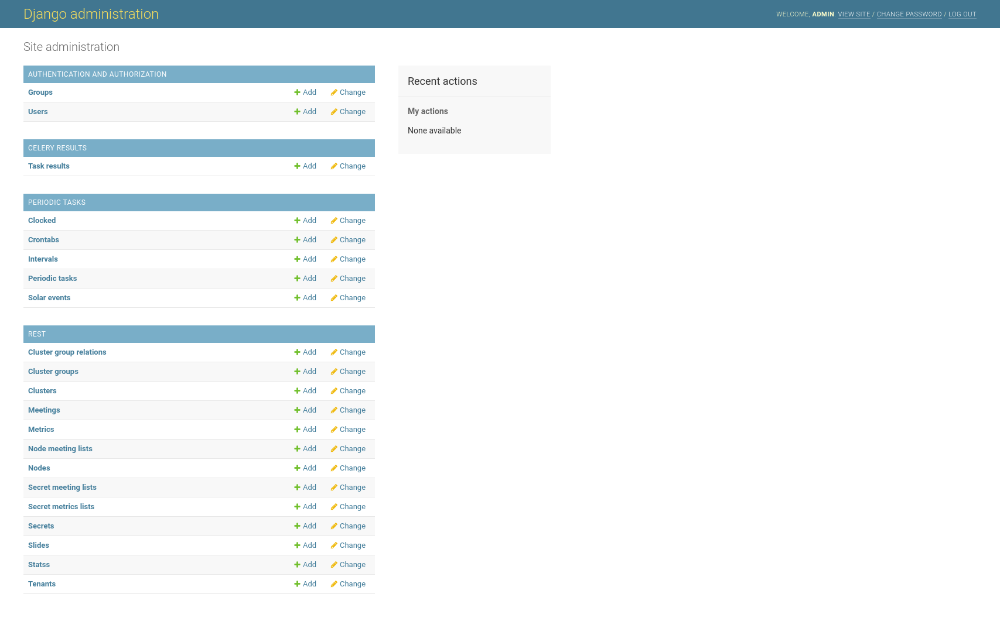
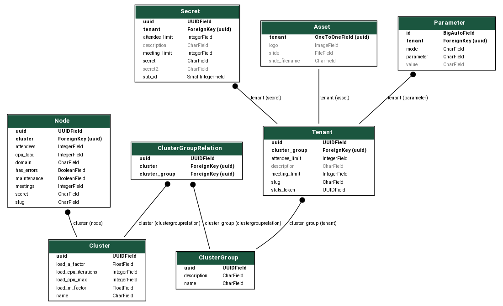

First Steps
===========

You need to do the following initial operations to get your B3LB instance operational.

Initial fixture
---------------

B3LB ships with a initial fixture to configure the celery scheduled tasks:

.. code-block:: console

    $ docker-compose exec django ./manage.py loaddata periodictasks
    Installed 6 object(s) from 1 fixture(s)

Create a superuser
------------------

A initial Django superuser login needs to be created on the CLI to be able to login to the Django admin pages:

.. code-block:: console

    $ docker-compose exec django ./manage.py createsuperuser
    Username (leave blank to use 'root'): admin
    Email address: admin@example.com
    Password:
    Password (again):
    Superuser created successfully.

Login at ``https://{{ api_base_domain }}/admin/`` using the admin credentials:

.. image:: _static/django-admin/login.png

After logging in you are able to view and edit the Django models:

Configure backend
-----------------

With the admin login you can configure the required backend instances. The following database schema shows the relation between most of the diffent models used in B3LB:

Create the following instances as necessary:

* a *cluster* to group BBB nodes
* a *cluster group*
* a *cluster group relation* to assign *clusters* to one or more *cluster groups*
* a BBB *node* assign to a *cluster*
* a *tenant* using a *cluster group*
* a *secret* with sub id ``0`` for each tenant
